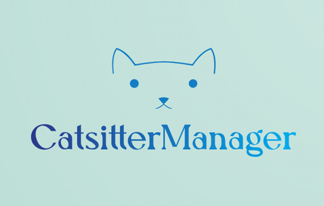

# CatsitterManager

## Inleiding

Wanneer ik met mijn gezin op vakantie ga, blijft onze kat altijd thuis. Het is van groot belang dat onze kat goed
verzorgd wordt tijdens onze afwezigheid. Daarom maken we al jaren gebruik van een klein bedrijfje dat een oppasservice
aanbiedt. Elke dag komt er een kattenoppas langs. De eigenaar van het bedrijf doet het werk deels zelf, maar heeft ook
enkele andere oppassen in dienst. Telkens als er een nieuwe oppas komt, moet ik veel informatie doorgeven en afspraken
maken. Denk hierbij aan ons adres, betalingsafspraken en details over de kat. Ook moet ik elke keer opnieuw instructies
achterlaten voor de verzorging, zelfs als de betreffende oppas eerder bij ons is geweest. De eigenaar heeft een database
met klantgegevens, gekoppeld aan klantnummers. Ik vraag me echter af of de andere kattenoppassen toegang hebben tot deze
gegevens.

Zo kwam ik op het idee om dit gegeven te gebruiken voor mijn eindopdracht voor de leerlijn Backend van de NOVI
Hogeschool te Utrecht. Het doel was om een platform te ontwikkelen waarin alle betrokkenen samen kunnen komen: de
bedrijfseigenaar, de kattenoppassen en de kattenbaasjes. Elk met hun eigen rol en bijbehorende bevoegdheden.

## Globale beschrijving

De werktitel van deze applicatie is “CatsitterManager”. Voor deze eindopdracht heb ik alleen de backend geprogrammeerd.
Het betreft een RESTful webservice, geprogrammeerd in Java en gebruikmakend van het Spring Boot-framework. De webservice
beheert data via endpoints (getest met het programma Postman) en kan communiceren met een Postgres-database die ik ook
zelf heb opgezet. Voor een volledig werkende applicatie is uiteraard ook een frontend nodig, maar dat is wellicht iets
voor in de toekomst!

Het grootste deel van de applicatie heb ik gebouwd gedurende en na de Java High Intensity Training bij
IT-consultancybedrijf Sogeti Nederland, uiteraard in afstemming met NOVI Hogeschool.

Voor developers die interesse hebben om de applicatie te bekijken en te testen kan ik een uitgebreide
installatiehandleiding aanleveren. Neem daarvoor gerust contact op!

## Belangrijkste functionaliteiten

• Gebruikers moeten inloggen met een gebruikersnaam en wachtwoord. Er zijn twee rollen: admin (eigenaar), customer en
catsitter. Authenticatie wordt gedaan middels een JWT-token.
• De eigenaar kan nieuwe klanten, kattenoppassen, orders en rekeningen toevoegen, en bestaande gegevens wijzigen. Tevens
beheert hij financiële gegevens, waaronder facturatie en betalingen.
• Katteneigenaren definiëren diensten (orders) die zij willen afnemen. Bij elke order hoort een set aan taken die
verricht moeten worden door de kattenoppas, die ze kunnen wijzigen. Zij kunnen ook zien welke rekeningen zij hebben
betaald of nog open hebben staan.
• Kattenbaasjes hebben toegang tot en mogelijkheid tot wijzigen van hun eigen profiel, afgenomen diensten, en informatie
over hun kat(ten), inclusief uploadmogelijkheid voor kattenfoto's. Zij kunnen ook het profiel van de aan een order
gekoppelde kattenoppas bekijken.
• Kattenoppassen hebben een eigen profiel dat ze kunnen wijzigen naar wens. Zij kunnen gegevens inzien van de klanten en
de bijbehorende katten van hun orders, maar kunnen daarin geen wijzigingen aanbrengen.

## Beperkingen en ideeën  voor doorontwikkeling

- Er is op dit moment nog weinig interactie mogelijk, de functionaliteit is nog voornamelijk gericht op
  het uploaden en inzien van informatie. Het is wellicht een idee om de applicatie uit te breiden met een
  berichtenservice, waarin kattenoppassen en katteneigenaren direct met elkaar kunnen communiceren, de oppas kan
  bijvoorbeeld schrijven over hoe hoe het gaat met de kat tijdens de oppasperiode en /of een foto of video sturen.
- Er zou een kalenderfunctie moeten worden ingebouwd. Het idee daarvan is dat klanten in de kalender kunnen aangeven
  voor welke tijdsperiode zij een oppas zoeken, en dat kattenoppassen hier een melding van krijgen als zij in die
  periode beschikbaar zijn. Zo kunnen katteneigenaren en oppassen op een meer directe manier met elkaar in contact
  komen.
- Een module voor het opstellen van een gespecificeerde rekening zou een mooie aanvulling kunnen zijn. Alle gegevens
  hiervoor zijn aanwezig (aantal bezoeken per dag en totaal, taken met bijbehorend tarief), en daarnaast kunnen
  klantgegevens, naam van de kattenoppas, ordernummer en factuurnummer worden toegevoegd. Echter, op dit moment is daar
  nog geen logica voor geschreven.
- Mogelijk zou het integreren van een extern betaalsysteem ook nuttig kunnen zijn, zodat klanten binnen de applicatie
  direct hun rekeningen kunnen betalen. Dit vraagt waarschijnlijk wel een hogere mate van security-maatregelen dan wat
  er nu aanwezig is.

## Verantwoording "persoonlijke gegevens" in data.sql bestand.

Voor testdoeleinden is een data.sql file aanwezig waarmee je een database kunt vullen. Alle genoemde namen, adressen en
andere persoonsgegevens zijn fictief, en dus niet te herleiden tot bestaande personen.

## Verantwoording afbeelding logo

Het CatsitterManager-logo is AI-gegenereerd op de website looka.com.

## Contact

Vragen of opmerkingen? Laat een comment achter in de repository op GitHub of stuur mij een e-mail op
marjet_bosma@hotmail.com.

© Marjet Bosma, Eindopdracht Backend, NOVI Hogeschool